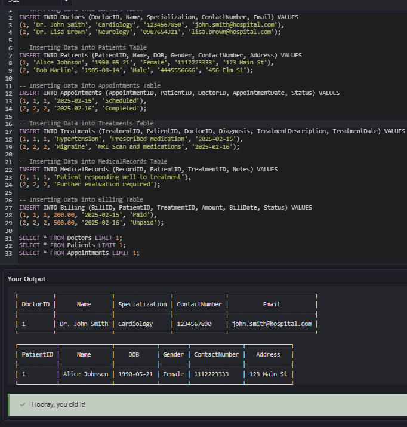

# Experiment 1

**Name:** Kavya Goyal 
**UID:** 24BCS12784

## Aim

To insert the provided records into the hospital database tables and retrieve the first record from the Doctors, Patients, and Appointments tables using SQL queries.

## Question

**Step 1:**  
Insert the following records into the respective hospital database tables exactly as specified below. Ensure that the table names, column names, and values remain unchanged.

**Step 2:**  
After inserting the records, write SQL queries to retrieve the first record from the Doctors, Patients, and Appointments tables.

### Doctors Table

| DoctorID | Name           | Specialization | ContactNumber | Email                   |
| -------- | -------------- | -------------- | ------------- | ----------------------- |
| 1        | Dr. John Smith | Cardiology     | 1234567890    | john.smith@hospital.com |
| 2        | Dr. Lisa Brown | Neurology      | 0987654321    | lisa.brown@hospital.com |

### Patients Table

| PatientID | Name          | DOB        | Gender | ContactNumber | Address     |
| --------- | ------------- | ---------- | ------ | ------------- | ----------- |
| 1         | Alice Johnson | 1990-05-21 | Female | 1112223333    | 123 Main St |
| 2         | Bob Martin    | 1985-08-14 | Male   | 4445556666    | 456 Elm St  |

### Appointments Table

| AppointmentID | PatientID | DoctorID | AppointmentDate | Status    |
| ------------- | --------- | -------- | --------------- | --------- |
| 1             | 1         | 1        | 2025-02-15      | Scheduled |
| 2             | 2         | 2        | 2025-02-16      | Completed |

### Treatments Table

| TreatmentID | PatientID | DoctorID | Diagnosis    | TreatmentDescription     | TreatmentDate |
| ----------- | --------- | -------- | ------------ | ------------------------ | ------------- |
| 1           | 1         | 1        | Hypertension | Prescribed medication    | 2025-02-15    |
| 2           | 2         | 2        | Migraine     | MRI Scan and medications | 2025-02-16    |

### MedicalRecords Table

| RecordID | PatientID | TreatmentID | Notes                                |
| -------- | --------- | ----------- | ------------------------------------ |
| 1        | 1         | 1           | Patient responding well to treatment |
| 2        | 2         | 2           | Further evaluation required          |

### Billing Table

| BillID | PatientID | TreatmentID | Amount | BillDate   | Status |
| ------ | --------- | ----------- | ------ | ---------- | ------ |
| 1      | 1         | 1           | 200.00 | 2025-02-15 | Paid   |
| 2      | 2         | 2           | 500.00 | 2025-02-16 | Unpaid |

## SQL Queries Used

### Insert into Doctors

```sql
INSERT INTO Doctors (DoctorID, Name, Specialization, ContactNumber, Email) VALUES
(1, 'Dr. John Smith', 'Cardiology', '1234567890', 'john.smith@hospital.com'),
(2, 'Dr. Lisa Brown', 'Neurology', '0987654321', 'lisa.brown@hospital.com');
```

### Insert into Patients

```sql
INSERT INTO Patients (PatientID, Name, DOB, Gender, ContactNumber, Address) VALUES
(1, 'Alice Johnson', '1990-05-21', 'Female', '1112223333', '123 Main St'),
(2, 'Bob Martin', '1985-08-14', 'Male', '4445556666', '456 Elm St');
```

### Insert into Appointments

```sql
INSERT INTO Appointments (AppointmentID, PatientID, DoctorID, AppointmentDate, Status) VALUES
(1, 1, 1, '2025-02-15', 'Scheduled'),
(2, 2, 2, '2025-02-16', 'Completed');
```

### Insert into Treatments

```sql
INSERT INTO Treatments (TreatmentID, PatientID, DoctorID, Diagnosis, TreatmentDescription, TreatmentDate) VALUES
(1, 1, 1, 'Hypertension', 'Prescribed medication', '2025-02-15'),
(2, 2, 2, 'Migraine', 'MRI Scan and medications', '2025-02-16');
```

### Insert into MedicalRecords

```sql
INSERT INTO MedicalRecords (RecordID, PatientID, TreatmentID, Notes) VALUES
(1, 1, 1, 'Patient responding well to treatment'),
(2, 2, 2, 'Further evaluation required');
```

### Insert into Billing

```sql
INSERT INTO Billing (BillID, PatientID, TreatmentID, Amount, BillDate, Status) VALUES
(1, 1, 1, 200.00, '2025-02-15', 'Paid'),
(2, 2, 2, 500.00, '2025-02-16', 'Unpaid');
```

### Retrieve First Record from Doctors

```sql
SELECT * FROM Doctors LIMIT 1;
```

### Retrieve First Record from Patients

```sql
SELECT * FROM Patients LIMIT 1;
```

### Retrieve First Record from Appointments

```sql
SELECT * FROM Appointments LIMIT 1;
```

## Output

```text
┌──────────┬────────────────┬────────────────┬───────────────┬─────────────────────────┐
│ DoctorID │      Name      │ Specialization │ ContactNumber │          Email          │
├──────────┼────────────────┼────────────────┼───────────────┼─────────────────────────┤
│ 1        │ Dr. John Smith │ Cardiology     │ 1234567890    │ john.smith@hospital.com │
└──────────┴────────────────┴────────────────┴───────────────┴─────────────────────────┘

┌───────────┬───────────────┬────────────┬────────┬───────────────┬─────────────┐
│ PatientID │     Name      │    DOB     │ Gender │ ContactNumber │   Address   │
├───────────┼───────────────┼────────────┼────────┼───────────────┼─────────────┤
│ 1         │ Alice Johnson │ 1990-05-21 │ Female │ 1112223333    │ 123 Main St │
└───────────┴───────────────┴────────────┴────────┴───────────────┴─────────────┘

┌───────────────┬───────────┬──────────┬─────────────────┬───────────┐
│ AppointmentID │ PatientID │ DoctorID │ AppointmentDate │  Status   │
├───────────────┼───────────┼──────────┼─────────────────┼───────────┤
│ 1             │ 1         │ 1        │ 2025-02-15      │ Scheduled │
└───────────────┴───────────┴──────────┴─────────────────┴───────────┘

The output confirms that all SQL statements were executed successfully.
```

## Output Screenshot



## Image Explanation

The screenshot shows the successful execution of SQL INSERT statements for all six hospital database tables. It also displays SELECT queries with the LIMIT 1 clause, confirming that the first record from the Doctors, Patients, and Appointments tables was retrieved successfully.

## Result

All records were inserted successfully into the hospital database. The SELECT queries verified the data by retrieving the first record from the required tables./
