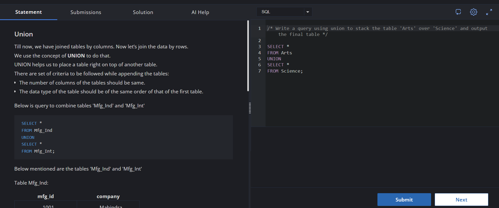
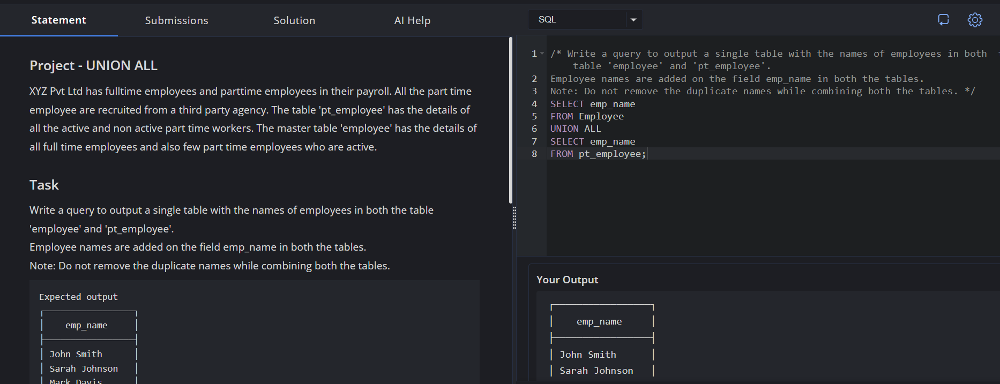
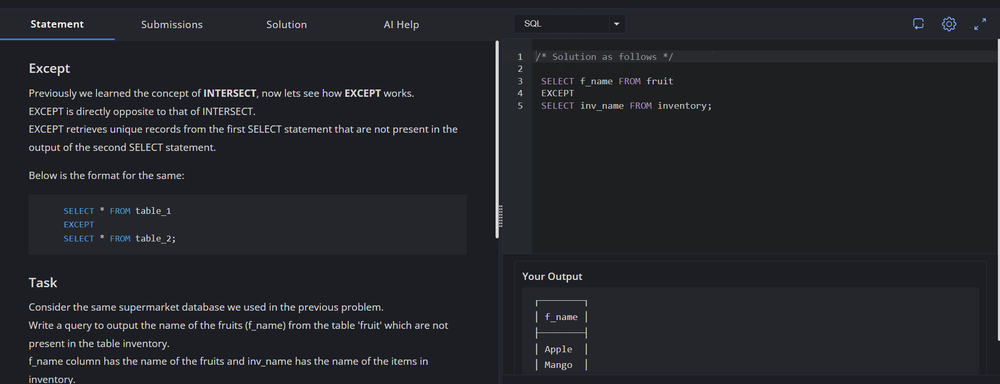

# Experiment 2

# Name: Kavya Goyal
**UID:** 24BCS12784

## Aim

To understand and implement SQL set operators UNION, UNION ALL, and EXCEPT for combining and comparing data from different tables.

## Question

**Part A – UNION**

UNION is used to combine the rows of two tables into a single result set. It removes duplicate records automatically.

Task:
Write a query using UNION to stack the table Arts over Science and display the final output.

SQL Query Used
SELECT *
FROM Arts
UNION
SELECT *
FROM Science;
Output
┌─────────┬─────────────┐
│ Stud_ID │ StudentName │
├─────────┼─────────────┤
│ 101     │ Rahul       │
│ 102     │ Priya       │
│ 201     │ Aman        │
│ 202     │ Neha        │
└─────────┴─────────────┘
**Explanation**

The UNION operator combines records from both the Arts and Science tables into a single result set. Any duplicate records, if present, are removed automatically.

**Part B – UNION ALL**

UNION ALL combines rows from two tables without removing duplicate records.

Task

XYZ Pvt Ltd maintains employee information in two tables:

Employee – contains full-time employees and some active part-time employees.
pt_employee – contains all part-time employees.

Write a query to display employee names from both tables without removing duplicate names.

SQL Query Used
SELECT emp_name
FROM Employee
UNION ALL
SELECT emp_name
FROM pt_employee;
Output
┌─────────────────┐
│    emp_name     │
├─────────────────┤
│ John Smith      │
│ Sarah Johnson   │
│ Mark Davis      │
│ Lisa Brown      │
│ Kevin Lee       │
│ Tom Wilson      │
│ Emily Parker    │
│ Mike Adams      │
│ Megan Kim       │
│ Adam Scott      │
│ Jessica Lee     │
│ David Chen      │
│ Julia Lee       │
│ Daniel Brown    │
│ Olivia Taylor   │
│ Maxwell Johnson │
│ Ashley Kim      │
│ Jackie Nguyen   │
│ Derek Smith     │
│ Emily Wang      │
│ Nate Thomas     │
│ Sophia Lee      │
│ Tom Wilson      │
│ Emily Parker    │
│ Mike Adams      │
│ Megan Kim       │
└─────────────────┘
Explanation

The UNION ALL operator combines the records from both tables and retains duplicate values. Therefore, employee names appearing in both tables are displayed multiple times.

**Part C – EXCEPT**

EXCEPT returns unique records from the first query that are not present in the second query.

Task

Using the supermarket database, write a query to display the names of fruits from the fruit table that are not present in the inventory table.

SQL Query Used
SELECT f_name
FROM fruit
EXCEPT
SELECT inv_name
FROM inventory;
Output
┌────────┐
│ f_name │
├────────┤
│ Apple  │
│ Mango  │
│ Orange │
└────────┘
Explanation

The EXCEPT operator compares the output of both queries and returns only those fruit names that exist in the fruit table but do not exist in the inventory table.

## Output Screenshot

## Image Explanation

The screenshot shows the successful execution of SQL queries using the UNION, UNION ALL, and EXCEPT operators. The results demonstrate how tables can be combined vertically, how duplicate records can be preserved, and how unique records can be extracted by comparing two tables.

## Result

The SQL set operators UNION, UNION ALL, and EXCEPT were successfully implemented. UNION combined records while removing duplicates, UNION ALL combined records while retaining duplicates, and EXCEPT returned records present in one table but absent in another. The output verified the correct working of all three operations.